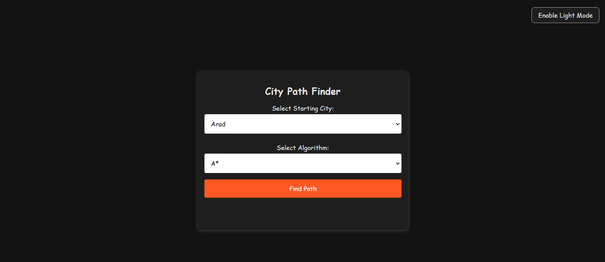

# City Path Finder

## Project Description

City Path Finder is a web application that utilizes the A\* and Greedy Best-First Search (GBFS) algorithms to determine the optimal route between cities. This project aims to demonstrate the implementation of these pathfinding algorithms with a user-friendly interface.

## Live Demo

Check out the live demo [here](https://hamzeh01.github.io/greedy-search/).

## Project Screenshot



## Features

- Select a starting city from a dropdown list.
- Choose between A\* and GBFS algorithms for pathfinding.
- View the optimal path and its cost displayed in a user-friendly manner.
- Toggle between light and dark modes for better visual comfort.

## Getting Started

Follow these instructions to get a copy of the project up and running on your local machine for development and testing purposes.

### Prerequisites

You will need the following software installed on your computer:

- Web browser (Chrome, Firefox, Safari, etc.)
- A text editor (VS Code, Sublime Text, Notepad++, etc.)

### Installing

1. Clone the repository to your local machine using the following command:

   ```bash
   git clone https://github.com/your-username/city-path-finder.git
   ```

2. Navigate to the project directory:

   ```bash
   cd city-path-finder
   ```

3. Open `index.html` in your web browser to view the application.

### Usage

1. Open the application in your web browser.
2. Select a starting city from the dropdown list.
3. Choose an algorithm (A\* or GBFS).
4. Click the "Find Path" button to calculate the optimal route.
5. View the resulting path and cost displayed below the button.
6. Use the toggle switch in the top right corner to switch between light and dark modes.

## Contributing

If you want to contribute to this project, please follow these steps:

1. Fork the repository.
2. Create a new branch (`git checkout -b feature-branch`).
3. Make your changes and commit them (`git commit -m 'Add new feature'`).
4. Push to the branch (`git push origin feature-branch`).
5. Open a pull request.

## License

This project is licensed under the MIT License - see the [LICENSE](LICENSE) file for details.
